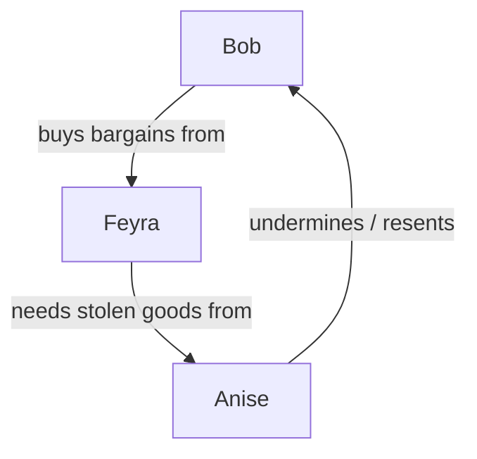

---
{"created":"2025-09-25T16:11","updated":"2025-09-29T09:28","type":"video","noteIcon":"bee","dg-publish":true,"dg-path":"Reference/@GameMasters2025HowRunSandbox.md","permalink":"/reference/game-masters2025-how-run-sandbox/","dgPassFrontmatter":true}
---

Simplify game setup with these techniques to create a sandbox with near unlimited possibilities. The video talks about these techniques in the context of Game Master preparation for group ttrpg games, but I think the techniques can be adapted for solo RPGs — these essentially utilise constraints to generate creativity, which support emergent narrative. 

> [!note] [Youtube Link](https://www.youtube.com/watch?v=R9C4mgPjv4A)

### Techniques I want to use for solo roleplay
There were three more techniques, but I opted not to take notes on them. 😅

This video has inspired me so much that I am doing some more prep-setting for [[Learn in Public/Play/Making Space for You\|Making Space for You]] which I will detail here: [[Learn in Public/Play/Actual Plays/Making Space For You/MSFY-000a Creating a sandbox\|MSFY-000a Creating a sandbox]]

#### Situation, NOT Story

Instead of preparing a story in advance, concoct situations for players and characters to respond to. 

> [!tip] Compelling situation = **Location + Conflict + Motivated characters** (PC & NPC)

For solo roleplay, this may mean fleshing out NPCs more, but I think this will combine well with [[Learn in Public/Reference/@GameMasters2025HowRunSandbox#NPC Triangle\|#NPC Triangle]] and [[Learn in Public/Reference/@GameMasters2025HowRunSandbox#5x5\|#5x5]] below. 

#### NPC Triangle 

Create tension and conflict by having 3 different NPCs with opposing motivations and desires. Interacting with the NPCs reveal the underlying tension and help shape the narrative. 

This sounds similar to [Karpman's Drama Triangle](https://cmdrysdale.wordpress.com/2015/03/20/using-karpmans-drama-triangle-to-help-develop-realistic-characters-in-when-writing-fiction-and-when-living-your-life/): where there is a victim, villain and rescuer (I don't know anything about this triangle, but I do want to learn more).

I gave ChatGPT what I thought was a good NPC Triangle, and then it pointed out that it wasn't good at all. Anyway, it gave me above, based off my idea.

Here's another example it gave me: 

> [!info]- ☕ Example: Tea Shop Triangle
-**Bob** wants quiet tea time.
-**Anise** wants to chat with him (she’s loud, friendly)
-**Feyra** wants to study in peace.
Loop:
> - Bob asks Anise to quiet down → hurts her feelings.
> - Anise vents to Feyra → Feyra sides with Bob (“yes, you’re loud”).
> - Feyra’s bluntness annoys Bob → now Bob avoids both of them.
All tiny, fixable conflicts → but until they talk it out, it’s drama!

##### 🔺 Cosy Drama Triangle Recipe

1. **Pick 3 characters.**
2. **Give each one a need/desire** that’s good in itself.
3. **Make those needs conflict in a loop.** (A’s need blocks B, B’s need blocks C, C’s need blocks A.)

#### 5x5
Draw a grid that has 5 columns and 6 rows. Make each column a distinct category. Filling out each column with your ideas will give you 25 distinct prompts that you can mix and match in new ways. 

The video suggests the following columns: 
- Locations
- Villains
- Rumours 
- Events 
- Treasures 

I imagine you can change the columns to whatever you like. 

I feel like this would be especially useful in a solo rpg setting because combining prompts in unexpected ways will probably lead to unexpected roleplay scenarios. 

#### Yes... BUT! 
Your 1d6 dice roll might say yes or no. But it's more interesting, if your days says "Yes, BUT... there's a catch" or "Yes, AND... there's something else". Conversely, "No, BUT..." could turn a negative into something neutral or even positive; "No, AND..." could make a bad roll even worse. 

"Yes, AND..." is a key technique in [Improv](https://en.wikipedia.org/wiki/Yes,_and...)/

#### Clockwork 
Plan a pre-ordained event that affects the story and your player character/s in some way. Your character doesn't need to know what is happening in-game for them to be affected. 

- Example provided: Necromancer hatches a plan. While party is adventuring, if the party inquires, they would notice that some people are disappearing. At a predetermined day, the event happens whether or not the party knew about it beforehand. They still need to react to it. 
- Cosy setting: Two NPCs are getting married. Player may not be invited or be aware. Other NPCs may or may not be available to interact with, depending on their relationship to affianced couple and their jobs. 
- Also cosy setting: An NPC is moving into town. Some NPCs are preparing for this by building their home / store. On the day they move in, the new NPC causes a flood due to bad piping. 

#### Reskin
Take an existing resource and apply a new skin to make it fresh. Modify accordingly. 

- Combat: Zombie becomes Sand Wolf 
- Character: Old Man who runs the Inn becomes Old Woman who runs the Tavern 