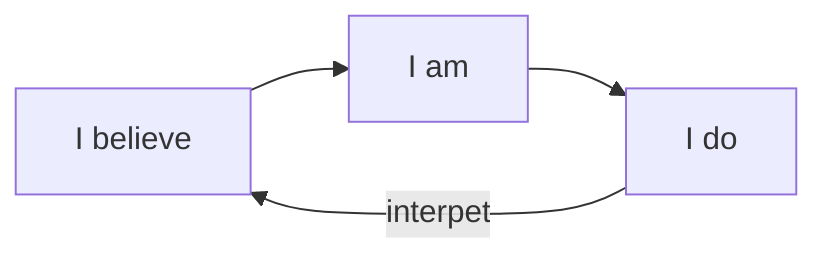

---
{"created":"2025-06-24T11:11","updated":"2025-09-04T13:58","id":"1a3a","dg-permalink":"1a3a-actions-identity","dg-publish":true,"dg-path":"Think/(1A3A) Shift your identity by changing your actions.md","permalink":"/1a3a-actions-identity/","dgPassFrontmatter":true,"noteIcon":"1"}
---

If I do, so I am, AND I am, so I do. 

Then it follows that changing what you do can change who you are. 

This might take a while. You'll need to fight off the effects of cognitive dissonance, minimising, etc. But you can use current and past actions as proof that your identity has changed. 

**Prev**:: [[Learn in Public/Think/(1A3) We act out our identity\|(1A3) We act out our identity]]

**supports**:: [[Learn in Public/Think/(5A2A) Take Small Visible Actions\|(5A2A) Take Small Visible Actions]]